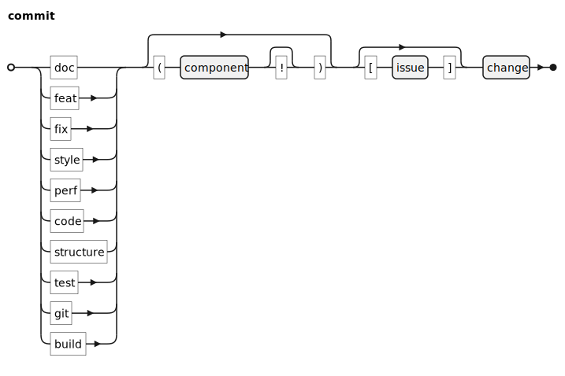
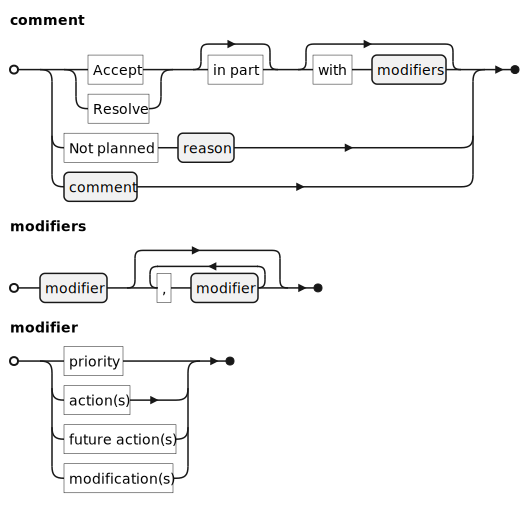
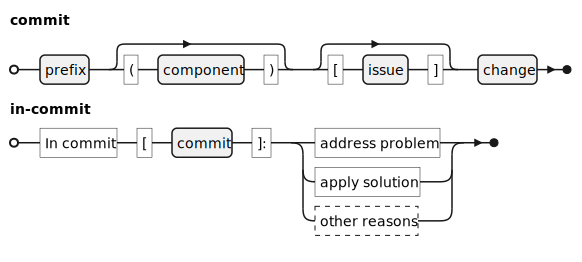
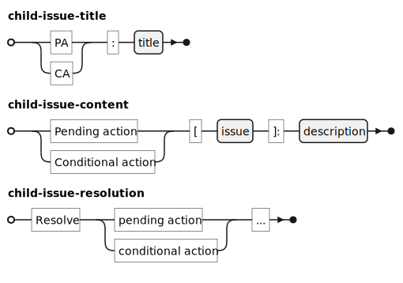

# Commits

## Writing Style

Write commit messages according to the following guidelines:

* Write in the *present tense*, the *active voice*, and the *imperative mood*
* Always write *concise, title-only* commit messages

## Prefixes

Prefix commit messages with one of the following labels[^1].

|Label|Action|
|-|--------|
|doc: | Add, remove, or change documentation |
|feat:| Add or remove a feature|
|fix:| Fix a problem in code |
|style:| Improve code readability |
|perf:| Improve code performance |
|code: | Other types of change in code |
|struct: | Other types of change in code that affect file structure |
|test: | Add, remove, or change test cases |
|git: | Deal with Git shenanigans |
|build: | Change build system, change external dependencies |
|meta: | Work that does not fall into the categories above |

Optionally, suffix the label with the component that is changed. For breaking changes, append an exclamation mark `!` to the component.

Optionally, suffix the label with an issue ID.

# Versioning

Because the EvoKit seeks to capture discipline
of evolutionary computing, it might receive
breaking changes 

For transparency, mark changes that substantially
affect EvoKit's "machinery" as breaking. To commit
such changes, prefix the label with a question
mark `?` (instead of `!`).

|Position|Name|Description|
|`X._._`|Major release|Significant change to how EvoKit should be used.|
|`_.Y._`|Minor release|Significant change to features that facilitates a use case.|
|`_._.Z`|Patch|Backward-compatible bug fixes.|

If a version includes changes in several
categories, use the highest in the list. For
example, use `X._._` over `_.Y._` if both
are applicable.

To update the version, commit a change to `pyproject.toml` and tag that commit with a brief
changelog. Document changes in the following format:

* **New**: Introduction of a new feature.

* **Change**: Change to an existing feature.

* **Fix**: Bugfix.

* **Remove**: Removal of a feature.

At this point, there is no label for deprecation.
Features may be deprecated and removed in the
same commit.

# Issues

## Writing Issues

Write issues that are concise, informative, and actionable:

**Concise** issues deal with one problem at a time. Such issues can be closed as soon as the one related problem is addressed.

**Informative** issues discuss the context and motivation.

**Actionable** issues provide information on how to solve the problem.

## Resolving Issues

### Comment

When closing an issue with comment, begin that comment with one of the following keywords.

|Keyword|Meaning|
|-|--------|
|Accept|Close as complete (external issue)|
|Not planned|Close as not planned|
|Resolve|Close as complete (internal issue)|
|-|Comments do not begin with a keyword|

Following the type, note actions after acceptance (or resolution) and reasons for rejection, according to the following syntax:

### Commits for Issues
In commits that address an issue, reference that issue.

In comments that close an issue, optionally link all commits that reference that issue.

### Child Issues
Before closing issues with modifiers `future action` or `conditional action`, create child issues that discuss the appropriate action or change. Then, reference these child issues.

In each child issue that is created this way, reference the parent issue.

The workflow for spawning and closing child issues is as follows. Note to use `Resolve` and not `Accept`, since child issues are created by developers.

The following diagram demonstrates the complete issue resolution process. Note the lack of forward references: the version control system should automatically generate forward references from backward references.

## Release Protocol

Complete the following tasks to publish a new version:

* Update and commit the version in [project file](./pyproject.toml).

    * Also edit and commit a new version in [CHANGELOG](./CHANGELOG.md).

* Update the tag with `git tag -a 'v..' -m '..'`. Show past tag messages with `git tag -n5`.

* Build with `python -m build .`

* Submit to PyPI with `twine upload dist/*`

[^1]: Developed in reference to [Contributing to Angular](https://github.com/angular/angular/blob/main/CONTRIBUTING.md)
